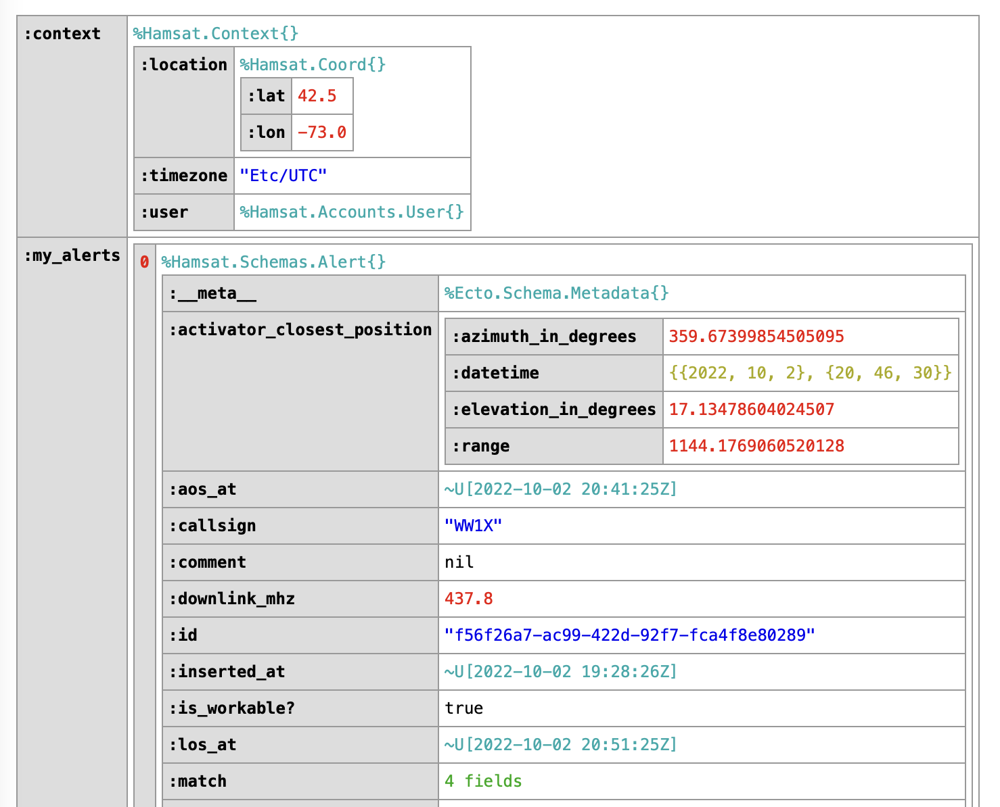

# LiveInspect

[](https://hex.pm/packages/live_inspect)
[](https://hexdocs.pm/live_inspect/)
[](https://github.com/schrockwell/live_inspect/blob/main/LICENSE)

Inspect LiveView assigns directly in the browser.

LiveView 0.17+ is currently supported.

## Example

```heex
<LiveInspect.live_inspect context={@context} my_alerts={@my_alerts} />
```

Maps and lists are collapsed by default, but can be clicked to expand and dig deeper.



## Installation

LiveInspect is a developer tool that should _never_ be used in a production environment, so be sure
to specify the `:only` option when adding it to your deps in `mix.exs`:

```elixir
def deps do
  [
    # IMPORTANT: Only in :dev environment!
    {:live_inspect, "~> 0.1.0", only: :dev}
  ]
end
```
